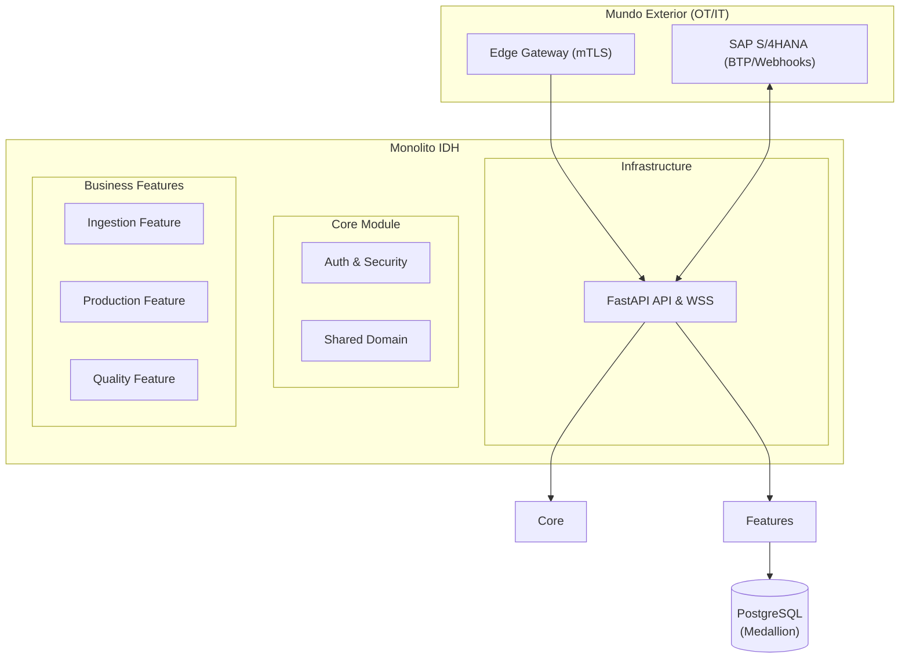

# Industrial Data Harmonizer (IDH)

[](https://www.python.org/downloads/)
[](LICENSE)
[](https://gapc87.github.io/industrial-data-harmonizer/)
[](https://github.com/astral-sh/ruff)
[](https://github.com/astral-sh/ruff)

**Un Monolito Modular Híbrido (Core-Feature) diseñado para cerrar la brecha entre la Planta (OT) y el ERP Corporativo (IT).**

El **Industrial Data Harmonizer (IDH)** es un middleware de grado empresarial diseñado para orquestar telemetría en tiempo real de maquinaria industrial, normalizar formatos de datos dispares (JSON, XML, CSV) y sincronizar eventos de negocio críticos con SAP S/4HANA mediante una estrategia de **Integridad Forense**.


---

## Características Clave

| **Arquitectura**       | Monolito Modular Híbrido (Core-Feature)                                       |
| **Convergencia OT/IT**     | Integración fluida entre protocolos industriales y lógica de IT                |
| **Resiliencia**            | Circuit Breakers para SAP, 7-day Edge Buffer (Store & Forward)                 |
| **Datos Medallion**        | Esquemas `raw_data` (Bronze/JSONB) y `public` (Silver/SQL)                    |
| **Seguridad ZeroTrust**    | Autenticación mTLS + OAuth2, conectividad Outbound-Only (Port 443)             |
| **Alto Rendimiento**       | Core async con FastAPI, SQLAlchemy 2.0 y `uv`                                 |

---

## Inicio Rápido

### Prerrequisitos

- **Python** 3.12+
- **Docker** y Docker Compose
- [**uv**](https://github.com/astral-sh/uv) - Gestor de paquetes ultrarrápido
- [**Just**](https://github.com/casey/just) - Task runner

### Instalación

```bash
# Clonar el repositorio
git clone https://github.com/gapc87/industrial-data-harmonizer.git
cd industrial-data-harmonizer

# Configurar entorno (crea .env con SECRET_KEY aleatoria)
just setup-env

# Instalar dependencias
just install
```

### Ejecutar

```bash
# Opción 1: Solo API (desarrollo con hot-reload)
just run

# Opción 2: Stack completo (API + PostgreSQL)
just up
```

**Swagger UI:** http://localhost:8000/docs

---

## Arquitectura



> **Más detalles:** Consulta la sección de Arquitectura en la [documentación oficial](https://gapc87.github.io/industrial-data-harmonizer/).

---

## Estructura del Proyecto

```
src/idh/
├── core/                # � Lógica Transversal (Inmune a cambios)
│   ├── domain/          # Entidades base (Gateway, User, BaseException)
│   └── security/        # mTLS, OAuth2 y RBAC
│
├── features/            # 🟢 Módulos de Negocio (Aislables)
│   ├── ingestion/       # Drivers PLC -> Raw Data landing
│   ├── production/      # SAP Sync -> Production flow
│   └── quality/         # Telemetría -> Quality check
│
└── infrastructure/      # 🔴 Detalle Técnico (Pegamento)
    ├── api/             # FastAPI setup y Routers globales
    ├── persistence/     # DB drivers y Session management
    └── logging.py       # Structured logging & Observability
```

---

## Stack Tecnológico

| **Core**         | Python 3.12, Pydantic V2, FastAPI, Uvicorn     |
| **Persistencia** | PostgreSQL 15.15+, SQLAlchemy 2.0 (Async)      |
| **Seguridad**    | mTLS, OAuth2, AES-256                          |
| **Integración**  | HTTPX, xmltodict, defusedxml                   |
| **Calidad**      | Ruff, MyPy (strict), check-architecture        |

---

## Testing

Seguimos la **Pirámide de Testing** con [Testcontainers](https://testcontainers.com/) para tests de integración contra PostgreSQL real.

```bash
# Suite completa
just test

# Solo unitarios (rápido)
just test-unit

# Con cobertura
just test-cov
```

---

## Comandos Disponibles

```bash
just --list          # Ver todos los comandos

# Desarrollo
just install         # Instalar dependencias
just run             # Servidor con hot-reload
just lint            # Formatear código (Ruff)
just typecheck       # Verificar tipos (MyPy)

# Docker
just up              # Levantar API + PostgreSQL
just down            # Detener servicios
just logs            # Ver logs

# Base de datos
just db-migrate      # Aplicar migraciones
just db-revision "mensaje"  # Nueva migración

# Documentación
just docs-serve      # Servir documentación local
just docs-export     # Exportar OpenAPI JSON
just docs-build      # Generar sitio estático
```

---

## Documentación

La documentación completa del proyecto está disponible en:

[](https://gapc87.github.io/industrial-data-harmonizer/)

También puedes explorarla localmente ejecutando:

```bash
just docs-serve
```

---

## Licencia

Este proyecto está bajo la licencia [MIT](LICENSE).

---

<p align="center">
  Desarrollado con ❤️ para la convergencia OT/IT
</p>
