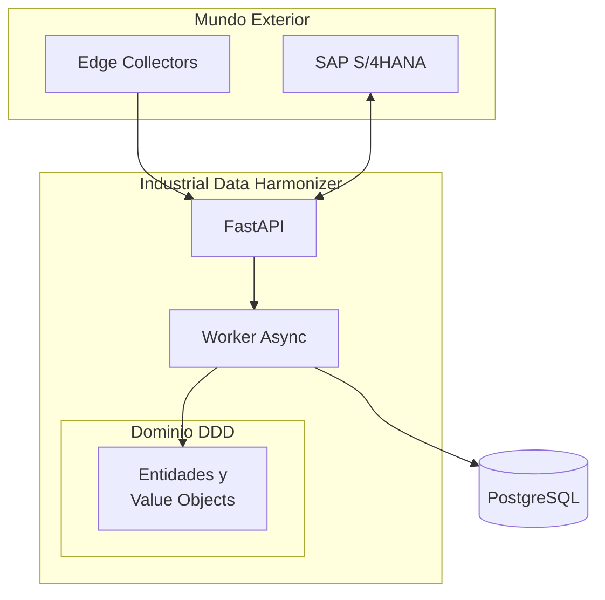

# Industrial Data Harmonizer (IDH)

[](https://www.python.org/downloads/)
[](LICENSE)
[](https://github.com/astral-sh/ruff)
[](https://github.com/astral-sh/ruff)

**Un Monolito Modular robusto para cerrar la brecha entre la Planta (OT) y el ERP Corporativo (IT).**

El **Industrial Data Harmonizer (IDH)** es un middleware de grado empresarial diseñado para orquestar telemetría en tiempo real de maquinaria industrial, normalizar formatos de datos dispares (JSON, XML, CSV) y sincronizar eventos de negocio críticos con SAP S/4HANA.

---

## Características Clave

| Característica | Descripción |
|----------------|-------------|
| **Convergencia OT/IT** | Integración fluida entre protocolos industriales y lógica de negocio |
| **Arquitectura Hexagonal** | Desacoplamiento total entre dominio e infraestructura (Puertos y Adaptadores) |
| **Resiliencia** | Circuit Breakers para SAP, Dead Letter Queues para eventos fallidos |
| **Datos Medallion** | Segregación entre `raw_data` (inmutable) y `domain_data` (validado) |
| **Seguridad Zero-Trust** | RBAC interno + OAuth2 para comunicación M2M |
| **Alto Rendimiento** | Core async con FastAPI, SQLAlchemy 2.0 y `uv` |

---

## Inicio Rápido

### Prerrequisitos

- **Python** 3.12+
- **Docker** y Docker Compose
- [**uv**](https://github.com/astral-sh/uv) - Gestor de paquetes ultrarrápido
- [**Just**](https://github.com/casey/just) - Task runner

### Instalación

```bash
# Clonar el repositorio
git clone https://github.com/gapc87/industrial-data-harmonizer.git
cd industrial-data-harmonizer

# Configurar entorno (crea .env con SECRET_KEY aleatoria)
just setup-env

# Instalar dependencias
just install
```

### Ejecutar

```bash
# Opción 1: Solo API (desarrollo con hot-reload)
just run

# Opción 2: Stack completo (API + PostgreSQL)
just up
```

📚 **Swagger UI:** http://localhost:8000/docs

---

## Arquitectura



> **Más detalles:** Consulta la sección de Arquitectura en la documentación oficial.

---

## Estructura del Proyecto

```
src/idh/
├── domain/              # 🟡 Núcleo DDD (sin dependencias externas)
│   ├── models/          # Entidades y Value Objects
│   ├── ports/           # Interfaces abstractas
│   └── exceptions.py    # Excepciones de negocio
│
├── application/         # 🟠 Casos de Uso
│   ├── services/        # Orquestación de dominio
│   └── dtos/            # Data Transfer Objects
│
└── infrastructure/      # 🔴 Implementaciones concretas
    ├── api/v1/          # Endpoints FastAPI
    ├── persistence/     # Repositorios SQLAlchemy
    ├── adapters/        # Clientes SAP, servicios externos
    ├── config.py        # Pydantic Settings (12-Factor)
    └── logging.py       # Structured logging
```

---

## 🛠️ Stack Tecnológico

| Categoría | Tecnologías |
|-----------|-------------|
| **Core** | Python 3.12, Pydantic V2, FastAPI, Uvicorn |
| **Persistencia** | PostgreSQL 15, SQLAlchemy 2.0 (Async), Alembic |
| **Integración** | HTTPX, xmltodict, defusedxml, APScheduler |
| **DevOps** | Docker, Docker Compose, Just, uv |
| **Calidad** | Ruff, MyPy (strict), Pytest, Testcontainers |

---

## Testing

Seguimos la **Pirámide de Testing** con [Testcontainers](https://testcontainers.com/) para tests de integración contra PostgreSQL real.

```bash
# Suite completa
just test

# Solo unitarios (rápido)
just test-unit

# Con cobertura
just test-cov
```

---

## Comandos Disponibles

```bash
just --list          # Ver todos los comandos

# Desarrollo
just install         # Instalar dependencias
just run             # Servidor con hot-reload
just lint            # Formatear código (Ruff)
just typecheck       # Verificar tipos (MyPy)

# Docker
just up              # Levantar API + PostgreSQL
just down            # Detener servicios
just logs            # Ver logs

# Base de datos
just db-migrate      # Aplicar migraciones
just db-revision "mensaje"  # Nueva migración

# Documentación
just docs-serve      # Servir documentación local
just docs-export     # Exportar OpenAPI JSON
just docs-build      # Generar sitio estático
```

---

## Documentación

La documentación completa del proyecto está disponible en:
[https://gapc87.github.io/industrial-data-harmonizer/](https://gapc87.github.io/industrial-data-harmonizer/)

También puedes explorarla localmente ejecutando:

```bash
just docs-serve
```

---

## 📄 Licencia

Este proyecto está bajo la licencia [MIT](LICENSE).

---

<p align="center">
  Desarrollado con ❤️ para la convergencia OT/IT
</p>
