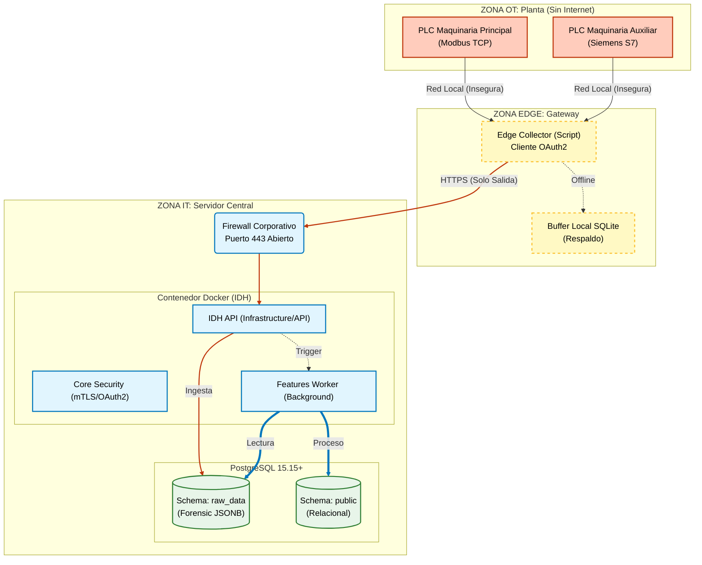
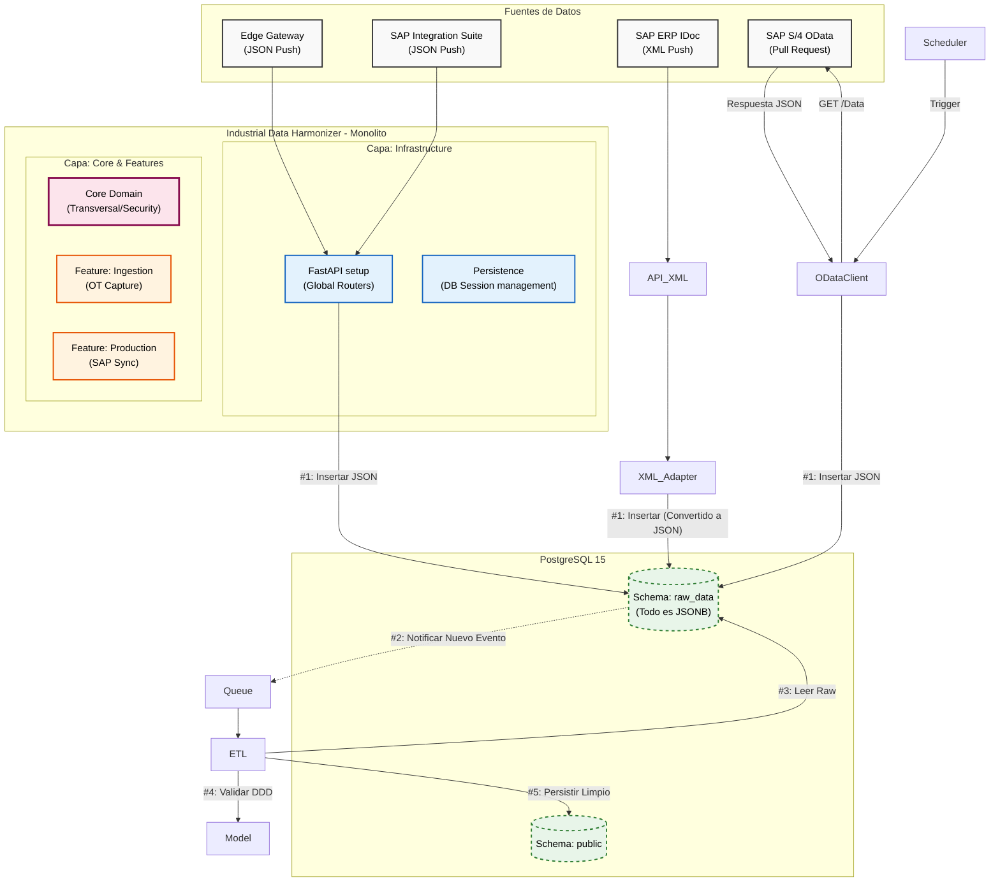

# Conceptos Arquitectónicos y Visión

**Versión:** 2.0.0
**Enfoque:** Monolito Modular, Hexagonal & DDD con Edge Computing.

## 1. Visión General

El proyecto **Industrial Data Harmonizer (IDH)** es una plataforma de middleware diseñada para cerrar la brecha tecnológica entre la planta de producción (OT) y los sistemas de gestión corporativa (IT).

Su misión es orquestar la convergencia de datos industriales, recolectando telemetría de maquinaria en tiempo real de forma segura, normalizando dicha información mediante reglas de negocio complejas, y exponiéndola a los departamentos de Producción, Calidad y Logística.

## 2. Estilo Arquitectónico: Monolito Modular

Se ha optado por un **Monolito Modular** en lugar de microservicios distribuidos.

* **Definición (Híbrido Core-Feature):** El sistema se despliega como una única unidad, pero se organiza en un **Core** (lógica transversal y seguridad) y múltiples **Features** aisladas (`ingestion`, `production`, `quality`).

* **Justificación:** Maximiza la productividad de un equipo pequeño al evitar la latencia de red entre servicios, pero garantiza un aislamiento físico que permite la futura extracción de una *Feature* (ej: Ingestión distribuida) con mínimo esfuerzo de refactorización.

## 3. Patrón Estructural: Arquitectura Hexagonal

Para desacoplar la lógica de negocio de las tecnologías externas, se implementa estrictamente la Arquitectura Hexagonal (Ports & Adapters).

* **Núcleo (Dominio):** Contiene la lógica pura de negocio (Reglas DDD). No tiene dependencias externas.

* **Puertos y Adaptadores:** La comunicación con el mundo exterior (Base de datos PostgreSQL, API REST, SAP) se realiza a través de interfaces (Puertos) e implementaciones (Adaptadores).

## 4. Metodologías y Stack Tecnológico

Para mantener esta visión clara, hemos extraído los detalles técnicos a documentos específicos:

*   **[Metodología de Diseño (DDD, TDD, CQRS)](methodology.md):** Profundiza en nuestros patrones tácticos, lenguaje ubicuo y estrategia de pruebas.
*   **[Stack Tecnológico](stack.md):** Detalle de lenguajes, frameworks y herramientas (Python 3.12+, FastAPI, Rust-based tooling).

## 5. Diagramas de Arquitectura

### A. Diagrama Físico: Topología de Red y Edge Computing

Este esquema ilustra cómo aislamos la red de fábrica (OT) de la red corporativa (IT).

### B. Diagrama Lógico: Flujo de Software y Capas

## 6. Alcance y Restricciones del MVP

Para garantizar el éxito del piloto y la seguridad operativa, se definen límites estrictos:

*   **Solo Lectura ("Read-Only"):** El sistema NO enviará comandos de escritura a los PLCs (no Start/Stop).
*   **Sin IA/ML:** En esta fase no se implementan modelos predictivos; el foco es la ingeniería de datos determinista.
*   **Sin WMS:** No se gestiona inventario físico ni ubicaciones de almacén.
*   **Web Responsive:** No hay App nativa, solo PWA accesible vía navegador.

## 7. Gestión de Configuración (12-Factor App)

Siguiendo la metodología **12-Factor App**, la configuración del entorno se desacopla estrictamente del código fuente.

* **Herramienta: Pydantic Settings**
    * **Enfoque:** Centralización de todas las variables de entorno (`.env`) en clases de configuración estrictamente tipadas.
    * **Fail Fast:** El sistema valida la existencia y el formato correcto de las credenciales al arranque. Si algo falla, aborta inmediatamente.
