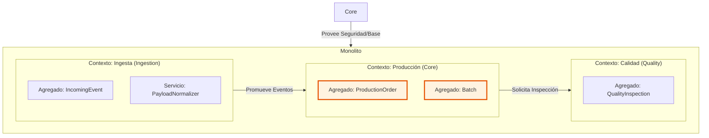

# Modelo de Dominio y Mapa de Contextos

El sistema **IDH** sigue un diseño de **Monolito Modular**, lo que significa que aunque el código viva en un solo repositorio, lógicamente está dividido en **Bounded Contexts** (Contextos Delimitados) que representan áreas funcionales de la fábrica.

Este documento sirve de guía para entender "qué va dónde" y asegurar que no cruzamos límites prohibidos (ej: Ingesta accediendo directamente a tablas de Producción).

## 1. Mapa de Contextos (Context Map)

## 2. Definición de Contextos

### A. Contexto de Ingesta (`features.ingestion`)
*   **Rol:** "La Aduana". Su única misión es aceptar paquetes de datos, validarlos sintácticamente y persistirlos.
*   **Aislamiento:** Mantiene su propio adaptador de entrada en `infrastructure/api`.
*   **Persistencia:** Escribe en el esquema `raw_data`.

### B. Contexto de Producción (`features.production`) - **CORE CORE**
*   **Rol:** "El Cerebro". Aquí residen las reglas que dan valor al IDH (sincronía con SAP).
*   **Responsabilidad:** Calcular eficiencias (OEE), gestionar estados de órdenes y validar la calidad del proceso.
*   **Persistencia:** Escribe en el esquema `public` (Tablas relacionales).

### C. Núcleo Transversal (`core.domain`)
*   **Rol:** Estructuras base compartidas por todos los contextos.
*   **Contiene:** Agregados transversales como `Gateway`, `User` y excepciones base.

## 3. Reglas de Interacción (The Rules of the Game)

Para mantener el monolito sano, seguimos reglas estrictas de dependencia:

1.  **Anti-Corruption Layer (ACL):** El Contexto de Producción NUNCA lee directamente las tablas `raw_data`. Recibe DTOs limpios procesados por el Worker.
2.  **Unidireccionalidad:** `Ingesta` no conoce a `Producción`. `Ingesta` publica un evento "Llegó un dato", y `Producción` reacciona.
3.  **Compartir IDs, no Objetos:** Entre contextos solo se pasan referencias (IDs), nunca, jamás, instancias de objetos ORM completos.
