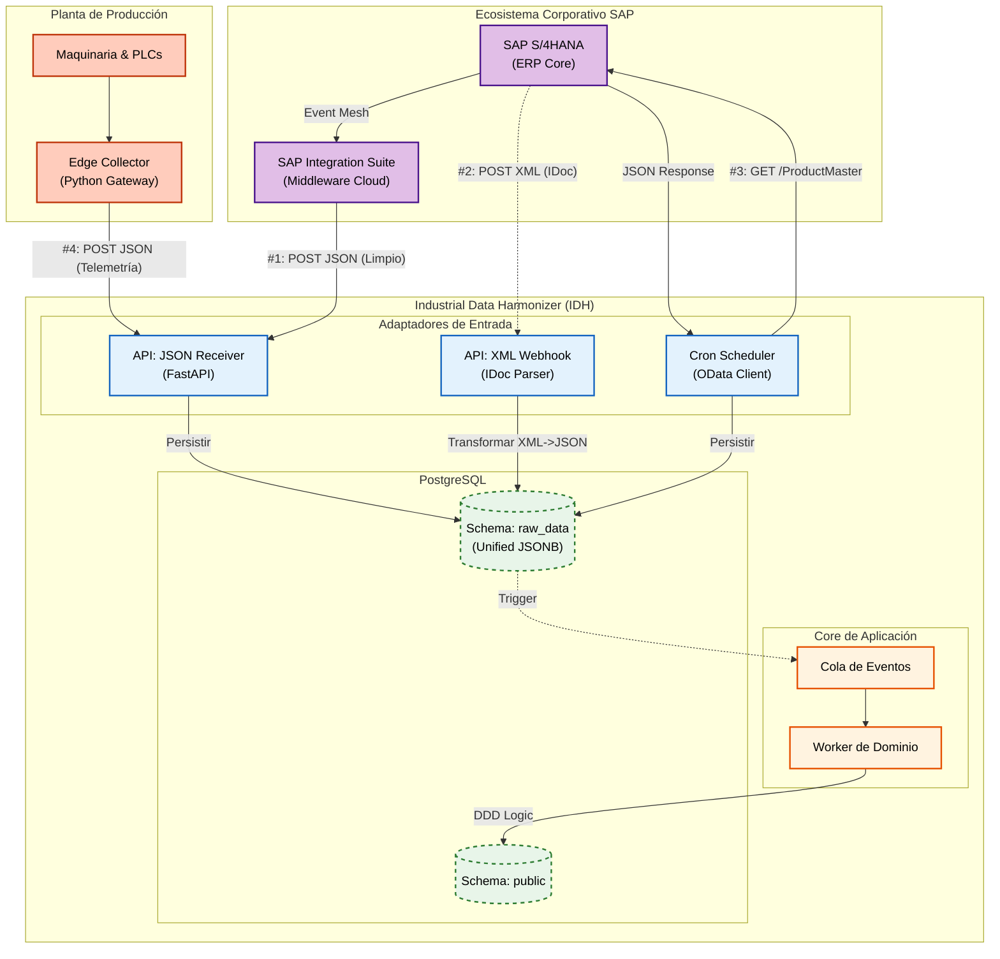

# Estrategia de Conectividad e Integración

Dado que las redes industriales son críticas y aisladas, se implementa una topología de seguridad física basada en el patrón **Edge Gateway** y una estrategia de integración híbrida para SAP.

## 1. Convergencia OT/IT (Edge Component)

* **El Desafío:** Las máquinas (PLCs) hablan protocolos inseguros (Modbus/OPC-UA) dentro de una red local sin internet.

* **La Solución (Outbound-Only):**

    * Se despliegan agentes ligeros (**Edge Collectors**) escritos en Python dentro de la planta.

	* Estos agentes leen los datos locales, los encriptan y los envían hacia la API Central (IDH) vía HTTPS.

	* La conexión es siempre **de salida** (Planta -> Nube), eliminando la necesidad de abrir puertos de entrada en el firewall industrial.

## 2. Integración con Ecosistema SAP

El sistema IDH implementa un **Patrón de Conectividad Universal** diseñado para operar en entornos SAP heterogéneos.

### Vía 1: SAP Integration Suite (Moderna)
* **Enfoque:** *API-First / Híbrido*.
* **Flujos:**
    * **Inbound:** SAP S/4HANA -> Integration Suite -> JSON -> IDH API (Creación de órdenes).
    * **Outbound:** IDH -> REST API -> SAP Integration Suite (Confirmaciones de fin de orden: Cantidad, Scrap, Tiempo).
    * **Resiliencia:** Implementación de *Circuit Breaker* para proteger el núcleo si SAP no está disponible.

### Vía 2: IDocs Legacy (Transaccional)
* **Enfoque:** *Direct Push / Fallback*.
* **Flujo:** SAP ERP -> XML IDoc -> Webhook IDH.
* **Mecanismo:** Un adaptador de entrada normaliza el XML a JSON antes de la persistencia.

### Vía 3: OData Services (Maestros)
* **Enfoque:** *Scheduled Pull*.
* **Flujo:** IDH (Cron Job) -> GET OData -> SAP ERP.
* **Uso:** Sincronización de catálogos de materiales y clientes.

* **Patrón Circuit Breaker:** Si SAP falla X veces consecutivas, el sistema deja de enviar peticiones temporalmente para proteger la estabilidad del núcleo via el adaptador en `features/production`.
* **Patrón Replay:** La arquitectura Medallion permite re-procesar eventos históricos desde `raw_data` para reconstruir el estado del dominio si las reglas de armonización cambian.

## 4. Comunicación en Tiempo Real (WSS)

Para los paneles de operario, se utiliza **WebSockets (WSS)** con un estándar estricto de eventos para asegurar la interoperabilidad con nodos Edge heterogéneos:

*   **Heartbeat Estándar:** Eventos `system.heartbeat` para monitoreo de conectividad.
*   **Bloque de Metadatos Obligatorio:** Todos los eventos deben seguir este formato:
    ```json
    {
      "metadata": {
        "source_gateway_id": "uuid",
        "origin_timestamp_utc": "iso-string",
        "event_type": "string"
      },
      "payload": { ... }
    }
    ```

## 4. Diagrama Global de Integración (OT + SAP Híbrido)


